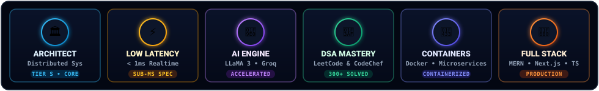

<div align="center">
  <picture>
    <source media="(prefers-color-scheme: dark)" srcset="./dark.svg" />
    <source media="(prefers-color-scheme: light)" srcset="./light.svg" />
    
  </picture>
</div>

<div align="center">

  <a href="https://www.linkedin.com/in/abhibhadouria08/" target="_blank">
    
  </a>
  <a href="mailto:abhinavsinghbhadouria.cs@gmail.com" target="_blank">
    
  </a>
  <a href="https://leetcode.com/ABHINAV_LATC/" target="_blank">
    
  </a>
  <a href="https://www.codechef.com/users/op_finalboss_7" target="_blank">
    
  </a>
  <a href="https://github.com/AbhinavSinghBhadouria" target="_blank">
    
  </a>

</div>

<div align="center" style="margin-top: 8px;">
  
  
  
</div>

<br />

---

### 👨‍💻 `About & Engineering Philosophy`

<table>
  <tr>
    <td width="26%" align="center" valign="middle">
      
      <br />
      <b>Abhinav Singh Bhadouria</b><br />
      <sub>Full-Stack &amp; AI Engineer</sub>
    </td>
    <td width="74%" valign="top">

```typescript
interface Developer {
  name: string;
  focus: string[];
  architecture: string[];
  principles: string[];
}

const abhinav: Developer = {
  name: "Abhinav Singh Bhadouria",
  focus: ["Scalable MERN Web", "Real-Time WebSocket Platforms", "LLM Inference & Agentic Workflows"],
  architecture: ["Distributed Microservices", "Containerization (Docker)", "High-Concurrency Caching (Redis)"],
  principles: ["Sub-millisecond Latency", "Clean Type-Safe Code", "Algorithmic Efficiency"]
};
```

    </td>
  </tr>
</table>

* 🔭 **Active Build**: Engineering robust real-time communication systems and AI workflows with sub-millisecond response guarantees.
* 🌱 **Researching**: Efficient retrieval-augmented generation (RAG), Groq-accelerated inference pipelines, and scalable microservice orchestration.
* ⚡ **Competitive Problem Solving**: Regular problem solver on **LeetCode** and **CodeChef**, continually optimizing time and space complexity.
* 💬 **Let's Talk About**: Full-Stack Architecture, React/Next.js ecosystem, Distributed WebSockets, Python, and DSA.

<br />

---

### 🖥️ `Interactive System Diagnostics & Node Telemetry`

<div align="center">
  
</div>

<br />

---

### 🚀 `Flagship Projects`

<table>
  <tr>
    <td width="33%" valign="top">
      <h3 align="center">🌐 Elyvo</h3>
      <p align="center"><b>Real-Time Communication Platform</b></p>
      <p>A full-duplex WebSocket platform containerized with Docker to guarantee horizontal scalability, high concurrency, and sub-millisecond messaging latency.</p>
      <ul>
        <li>Full-duplex WebSocket architecture</li>
        <li>Dockerized container deployment</li>
        <li>Sub-millisecond latency messaging</li>
      </ul>
      <br />
      <div align="center">
        
        
        
      </div>
    </td>
    <td width="33%" valign="top">
      <h3 align="center">🧠 Nebula Notes</h3>
      <p align="center"><b>AI Note Synthesis &amp; Knowledge Engine</b></p>
      <p>An intelligent workspace powered by the LLaMA 3 foundation model integrated via high-throughput Groq API for rapid summarization and contextual synthesis.</p>
      <ul>
        <li>LLaMA 3 AI text generation &amp; summarization</li>
        <li>Ultra-low latency Groq API integration</li>
        <li>MERN stack architecture &amp; state management</li>
      </ul>
      <br />
      <div align="center">
        
        
        
      </div>
    </td>
    <td width="33%" valign="top">
      <h3 align="center">📈 House Price Engine</h3>
      <p align="center"><b>End-to-End ML Regression Pipeline</b></p>
      <p>A robust machine learning pipeline built with Python and Scikit-Learn that predicts real estate valuations with high accuracy across multidimensional feature spaces.</p>
      <ul>
        <li>Multivariate regression &amp; data preprocessing</li>
        <li>Scikit-Learn predictive modeling</li>
        <li>Exploratory data analysis &amp; validation</li>
      </ul>
      <br />
      <div align="center">
        
        
        
      </div>
    </td>
  </tr>
</table>

<br />

<details>
  <summary><b>⚙️ Click to Expand: Deep Dive Architectural Specifications &amp; Design Specs</b></summary>
  <br />
  <blockquote>
    <h4>1. High-Concurrency WebSocket Topology (Elyvo)</h4>
    <p>Engineered around an event-driven loop separating connection handling from background message routing. Employs horizontal container scaling and connection pooling to ensure zero packet drop and sub-millisecond broadcast latency under concurrent socket handshakes.</p>
    
    <h4>2. Low-Latency Inference Pipeline (Nebula Notes)</h4>
    <p>Utilizes Groq LPU (Language Processing Unit) acceleration combined with token-stream chunking for sub-second text summarization. State persistence is managed through normalized document stores with optimistic UI rendering on the React frontend.</p>
    
    <h4>3. Predictive Modeling &amp; Feature Pipelines (ML Engine)</h4>
    <p>Standardized transformation pipelines including one-hot categorical encoding, outlier clipping via interquartile range (IQR), and cross-validated regularized regression (Ridge / Lasso) preventing overfitting.</p>
  </blockquote>
</details>

<br />

---

### 🛠️ `Technical Arsenal & Tooling`

<div align="center">

#### 💻 Programming Languages
<a href="https://skillicons.dev">
  
</a>

<br />

#### 🌐 Frontend & UI Engineering
<a href="https://skillicons.dev">
  
</a>

<br />

#### ⚙️ Backend, APIs & Real-Time
<a href="https://skillicons.dev">
  
</a>

<br />

#### 🗄️ Databases & Cloud Architecture
<a href="https://skillicons.dev">
  
</a>

<br />

#### 🤖 AI / Machine Learning & DevOps
<a href="https://skillicons.dev">
  
</a>

</div>

<br />

---

### ⚡ `Competitive Programming & DSA Mastery`

<div align="center">
  <a href="https://leetcode.com/ABHINAV_LATC/" target="_blank">
    
  </a>
</div>

<br />

<details>
  <summary><b>🧠 Click to View: Problem Solving Domains &amp; Algorithmic Mastery</b></summary>
  <br />
  <table>
    <tr>
      <td width="50%">
        <b>Core Algorithmic Strengths</b>
        <ul>
          <li>Dynamic Programming (1D / 2D / Bitmask)</li>
          <li>Graph Algorithms (Dijkstra, BFS/DFS, TopoSort, DSU)</li>
          <li>Binary Trees, BSTs &amp; Segment Trees</li>
          <li>Two Pointers &amp; Sliding Window Optimization</li>
        </ul>
      </td>
      <td width="50%">
        <b>System &amp; Engineering Focus</b>
        <ul>
          <li>Time Complexity: Strict O(N) / O(log N) runtime guarantees</li>
          <li>Space Optimization: In-place memory transforms</li>
          <li>Recursion to Iterative conversion &amp; Stack safety</li>
          <li>Asynchronous event-loop non-blocking models</li>
        </ul>
      </td>
    </tr>
  </table>
</details>

<br />

---

### 🏆 `Engineering Badges & Achievements`

<div align="center">
  
</div>

<br />

---

### 📈 `GitHub Analytics & Activity`

<div align="center">
  
  
</div>

<br />

<div align="center">
  
</div>

<br />

---

### 🐍 `Contribution Matrix`

<div align="center">
  <picture>
    <source media="(prefers-color-scheme: dark)" srcset="https://raw.githubusercontent.com/AbhinavSinghBhadouria/AbhinavSinghBhadouria/output/github-contribution-grid-snake-dark.svg" />
    <source media="(prefers-color-scheme: light)" srcset="https://raw.githubusercontent.com/AbhinavSinghBhadouria/AbhinavSinghBhadouria/output/github-contribution-grid-snake.svg" />
    
  </picture>
</div>

<br />

---

### 🤝 `Let's Connect & Collaborate`

<div align="center">

<table>
  <tr>
    <td align="center" width="25%">
      <a href="https://www.linkedin.com/in/abhibhadouria08/">
        <br />
        <sub><b>Network &amp; Careers</b></sub>
      </a>
    </td>
    <td align="center" width="25%">
      <a href="mailto:abhinavsinghbhadouria.cs@gmail.com">
        <br />
        <sub><b>Inquiries &amp; Collabs</b></sub>
      </a>
    </td>
    <td align="center" width="25%">
      <a href="https://leetcode.com/ABHINAV_LATC/">
        <br />
        <sub><b>Algorithm Track</b></sub>
      </a>
    </td>
    <td align="center" width="25%">
      <a href="https://github.com/AbhinavSinghBhadouria?tab=repositories">
        <br />
        <sub><b>Explore Codebases</b></sub>
      </a>
    </td>
  </tr>
</table>

</div>

<br />

---

<div align="center">
  <p><i>"Building high-performance systems through algorithmic clarity and resilient design."</i></p>
  <sub>Architected with ⚡ by <a href="https://github.com/AbhinavSinghBhadouria">Abhinav Singh Bhadouria</a> · Open Source Architecture</sub>
</div>

